# Academia 🧑‍🎓 (Course Registration Portal)


Welcome to the Academia project! This repository is dedicated to the development of a versatile Academia Portal, designed with user-friendliness and multifunctionality in mind. The goal of this project is to create a robust platform with various essential functionalities to manage academic data efficiently.

## Project Objectives

This Academia Portal is built to encompass the following core functionalities:

- **Data Storage:** All student and faculty details, along with course information, are stored in files for easy access and management.

- **User Authentication:** To ensure security and privacy, all account holders, including students and faculty, are required to pass through a login system. The administrator is responsible for managing these user accounts.

- **User Roles:** The portal supports three key roles: Faculty, Student, and Administrator.

- **Administrative Access:** The application incorporates password-protected administrative access, safeguarding the management system from unauthorized entry.

## User Interaction

### Administrator
Once the administrator connects to the server, they will be prompted to provide login credentials. After successful login, the administrator will have access to a menu offering options such as:

- Adding Students
- Adding Faculty
- Activating/Deactivating Students
- Updating Student/Faculty Details
- Exiting the system

### Student
When a student connects to the server, they will also go through a login process. Following successful login, the student will encounter a menu with choices like:

- Enrolling in New Courses
- Unenrolling from Already Enrolled Courses
- Viewing Enrolled Courses
- Changing Password
- Exiting the system

### Faculty
Faculty members follow a similar login process, and upon successful authentication, they are presented with a menu featuring options like:

- Adding New Courses
- Removing Offered Courses
- Viewing Enrollments in Courses
- Changing Password
- Exiting the system

### Data Protection

- To protect critical data, read and write locks are implemented. When viewing course details, a read lock is set. When enrolling or unenrolling, a write lock is employed to ensure the integrity of the data.

- The project utilizes socket programming, where the server manages the database and serves multiple clients concurrently. Clients can connect to the server to access their academic information securely.

- System calls are prioritized over library functions wherever possible in the project, utilizing various mechanisms such as process management, file management, file locking, semaphores, multithreading, and inter-process communication.

  

**How to Execute:**

  

Follow these steps to execute Academia:

  

1. Begin by adding a new Admin using the "create_admin.c" file.

2. Modify the absolute path as indicated in the code.

3. Compile and run the Server:

```shell

cc server.c -o s

./s

```

4. Compile and run the Client:

```shell

cc client.c -o c

./c

```

5. You're all set!

  

**Output:**

  

**Starting Application -**

  

- Create an Admin account

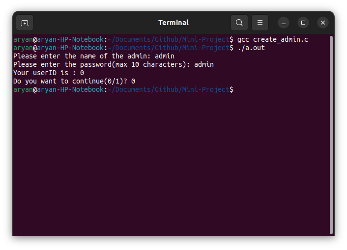

  

- Start the Server

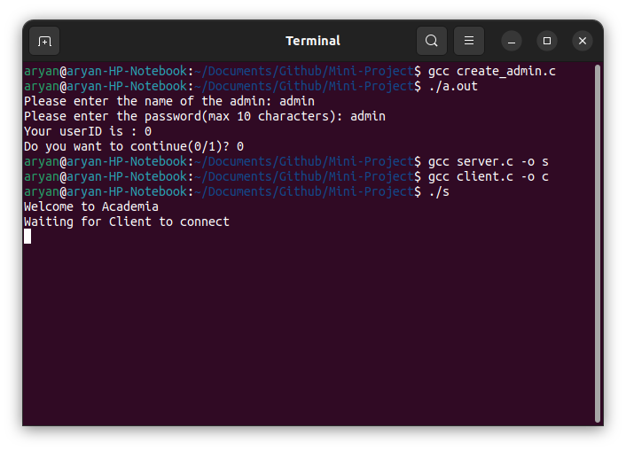

  

- Start the Client

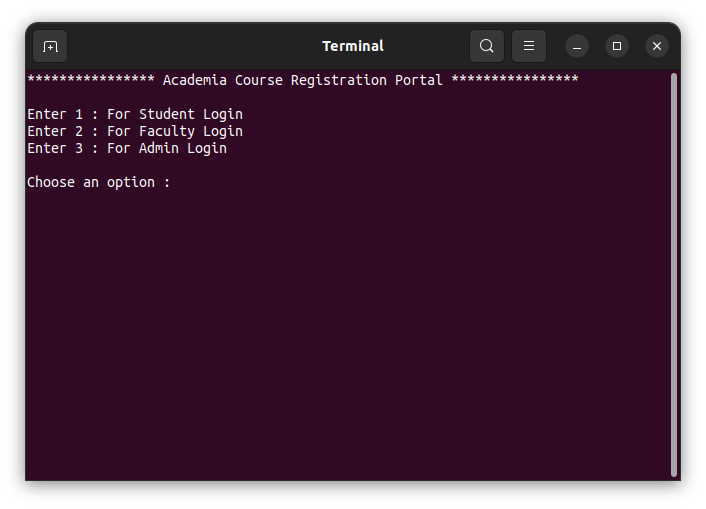

  

**Admin Functions -**

  

- Add a student

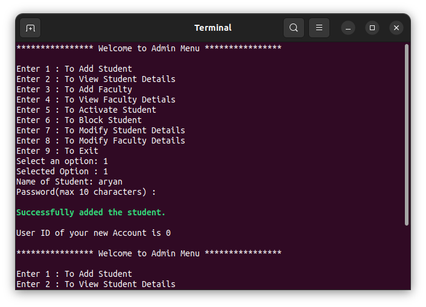

  

- View student details

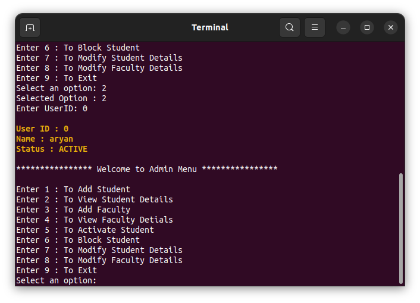

  

- Block a student

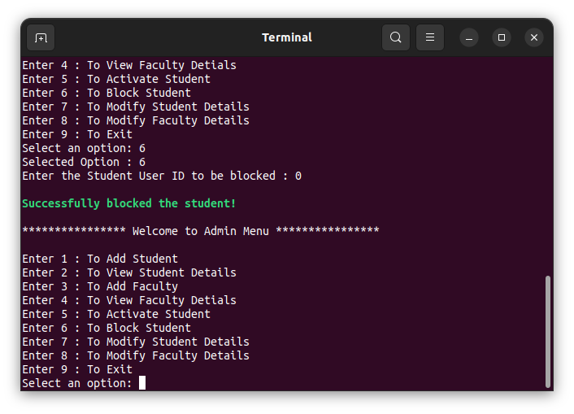

  

- After blocking

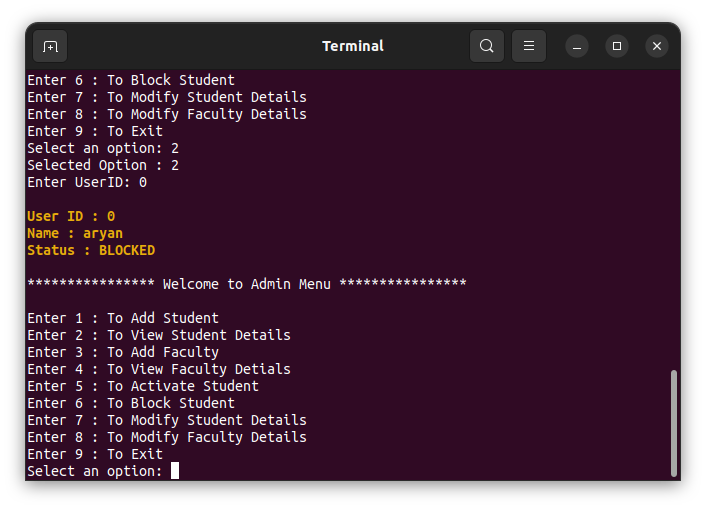

  

- Modify Faculty Details

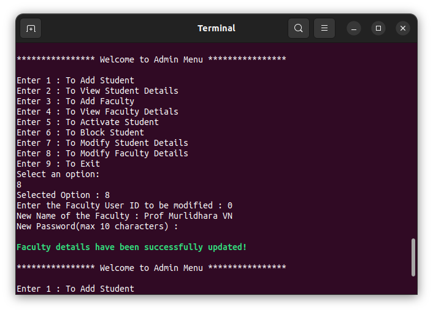

  

**Faculty Functions -**

  

- Add a new course

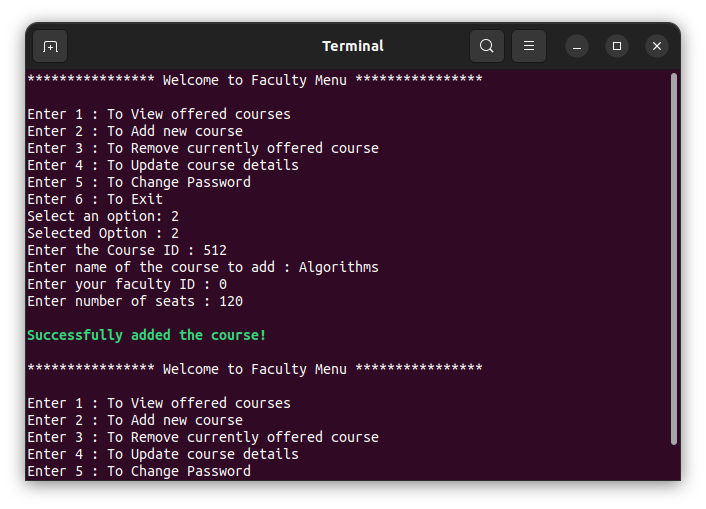

  

- View offered courses

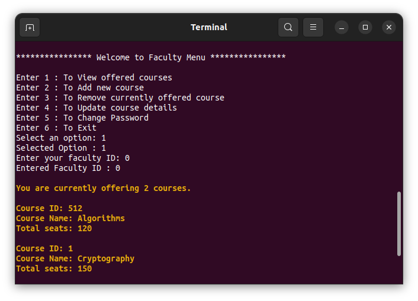

  

- Modify course details

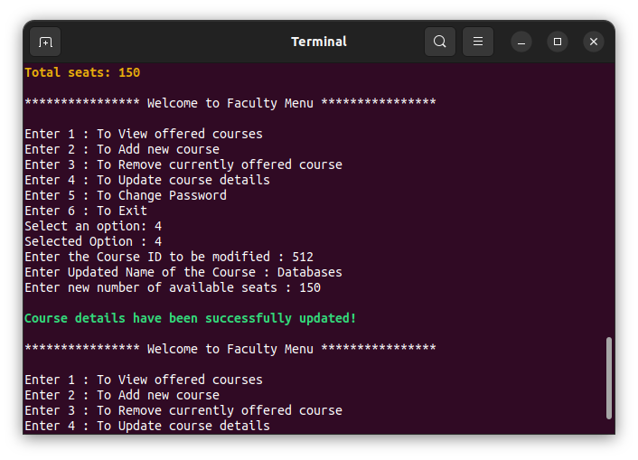

  

- After modifying a course

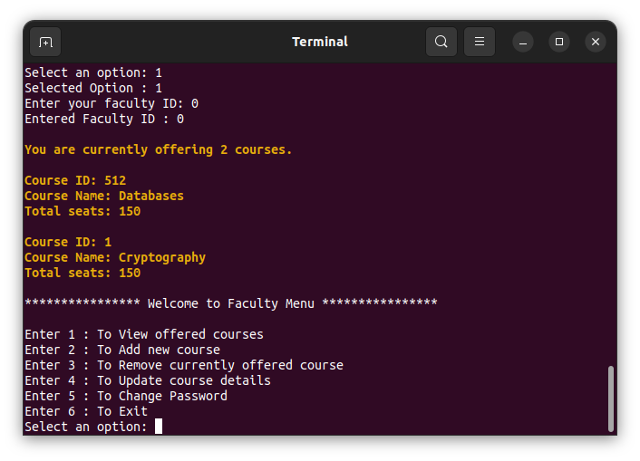

  

**Student Functions -**

  

- View all courses

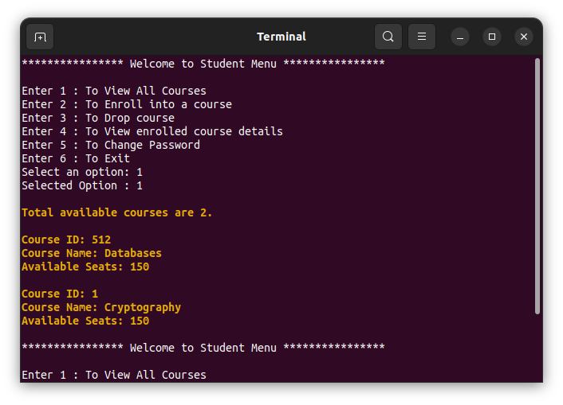

  

- Enroll in a course

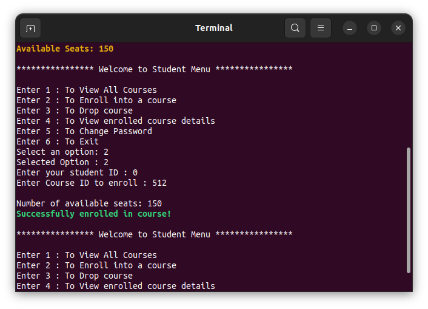

  

- View enrolled courses

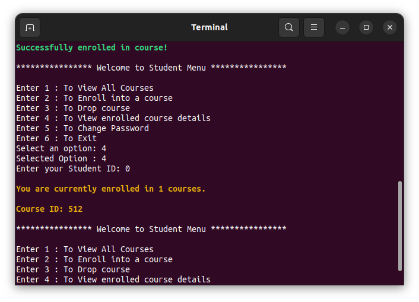

  

- Unenroll from a course

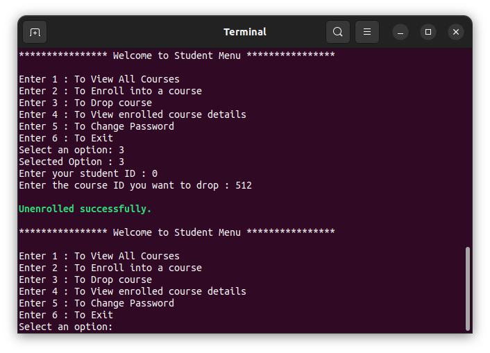
